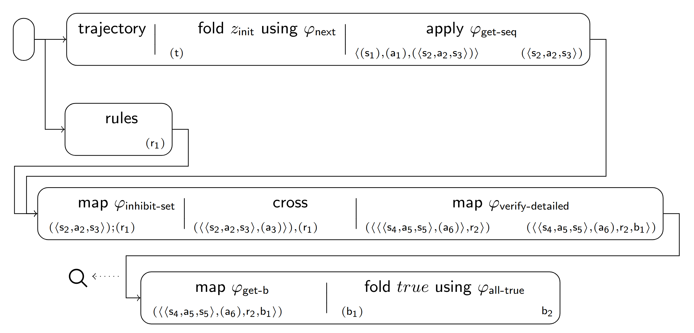

# [Verification Pipeline](https://julianmendez.github.io/verification-pipeline/)

[][license]
[][build-status]

The **Verification Pipeline** is an instantiation of the [Tiles][tiles] framework. Its classes are written
in [Soda][soda] and grouped in packages translated to [Scala][scala].

This project operationalizes action language semantics through executable verification pipelines.
It process states, actions, transitions, and rules.

## Requirements

This project requires [Java][java] 17 or higher and [sbt][sbt].
It is also possible to compile the project by using an [sbt script][sbt-extras].

## Use

This project be compiled by executing `makeall.sh`. The script can be run on Windows with [Git][git-scm] Bash.
The script compiles the project, creates an executable binary, and creates the directory `target/benchmarks` with an
example to
run the program.
Note that recompiling the project will delete the content of that directory to reset the conditions for new benchmarks.

More details on the input file can be found at the [input file details][about-input-file].

## Pipeline

These are some of the implemented fairness tiles for the scenario:

| Index | Tile or Pipeline                                            | Class                                                  |
|:------|:------------------------------------------------------------|:-------------------------------------------------------|
| 1     | trajectory *(t)*                                 | [TrajectoryTile][TrajectoryTile]                       |
| 2     | *(α)* fold zinit using φnext *(β)*    | [TransitionsTile][TransitionsTile]                     |
| 3     | *(α)* apply φget-seq *α*              | [ApplyTile][ApplyTile]                                 |
| 4     | rules *(r)*                                      | [RulesTile][RulesTile]                                 |
| 5     | *(α)* map φinhibit-set *(β)*          | [InhibitTile][InhibitTile]                             |
| 6     | *(α)* cross *(β)*                     | [CrossTile][CrossTile]                                 |
| 7     | *(α)* map φverify-detailed *(β)*      | [VerifierTile][VerifierTile]                           |
| 8     | *(α)* map φget-b *(β)*                | [Serializer][serializer]                               |
| 9     | *(α)* fold true using φall-true *(β)* | [Serializer][serializer]                               |
| 10    | composite (1 + 2 + 3)                                       | [TrajectoryTransitionsTile][TrajectoryTransitionsTile] |
| 11    | composite (5 + 6 + 7)                                       | [InhibitCrossVerifierTile][InhibitCrossVerifierTile]   |
| 12    | pipeline (10 + 4 + 11)                                      | [VerificationPipeline][VerificationPipeline]           |

## Author

[Julian Alfredo Mendez][author]

[ApplyTile]: https://github.com/julianmendez/verification-pipeline/blob/master/core/src/main/scala/soda/tiles/verifier/tile/primitive/ApplyTile.soda

[CrossTile]: https://github.com/julianmendez/verification-pipeline/blob/master/core/src/main/scala/soda/tiles/verifier/tile/primitive/CrossTile.soda

[InhibitTile]: https://github.com/julianmendez/verification-pipeline/blob/master/core/src/main/scala/soda/tiles/verifier/tile/derived/InhibitTile.soda

[InhibitCrossVerifierTile]: https://github.com/julianmendez/verification-pipeline/blob/master/core/src/main/scala/soda/tiles/verifier/tile/composite/InhibitCrossVerifierTile.soda

[MapTile]: https://github.com/julianmendez/verification-pipeline/blob/master/core/src/main/scala/soda/tiles/verifier/tile/primitive/MapTile.soda

[RulesTile]: https://github.com/julianmendez/verification-pipeline/blob/master/core/src/main/scala/soda/tiles/verifier/tile/constant/RulesTile.soda

[Serializer]: https://github.com/julianmendez/verification-pipeline/blob/master/core/src/main/scala/soda/tiles/verifier/main/Serializer.soda

[TrajectoryTile]: https://github.com/julianmendez/verification-pipeline/blob/master/core/src/main/scala/soda/tiles/verifier/tile/constant/TrajectoryTile.soda

[TrajectoryTransitionsTile]: https://github.com/julianmendez/verification-pipeline/blob/master/core/src/main/scala/soda/tiles/verifier/tile/composite/TrajectoryTransitionsTile.soda

[TransitionsTile]: https://github.com/julianmendez/verification-pipeline/blob/master/core/src/main/scala/soda/tiles/verifier/tile/derived/TransitionsTile.soda

[VerificationPipeline]: https://github.com/julianmendez/verification-pipeline/blob/master/core/src/main/scala/soda/tiles/verifier/pipeline/VerificationPipeline.soda

[VerifierTile]: https://github.com/julianmendez/verification-pipeline/blob/master/core/src/main/scala/soda/tiles/verifier/tile/derived/VerifierTile.soda

[author]: https://julianmendez.github.io

[build-status]: https://github.com/julianmendez/tiles/actions

[git-scm]: https://git-scm.com/install/windows

[about-input-file]: input.html

[java]: https://www.oracle.com/java/

[license]: https://www.apache.org/licenses/LICENSE-2.0.txt

[release-notes]: https://julianmendez.github.io/tiles/RELEASE-NOTES.html

[sbt]: https://www.scala-sbt.org/

[sbt-extras]: https://github.com/dwijnand/sbt-extras

[scala]: https://scala-lang.org

[soda]: https://github.com/julianmendez/soda

[tiles]: https://github.com/julianmendez/tiles

